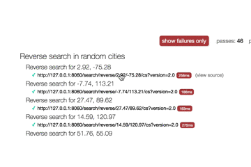
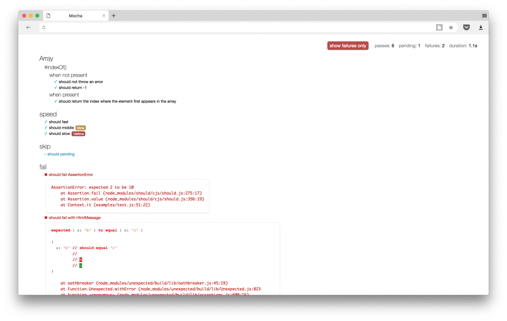

mocha-simple-html-reporter-linked
=================================
This is Windy's fork of https://github.com/blond/mocha-simple-html-reporter, that introduces these changes:

* Whenever URL is detected as description of `it(..)` function, it is displayed as clickable, so API's endpoints can be tested in browser. Example `it('http://localhost:8050/api/search', () => ...` 
* It displays time of the test in generated html file (to run report for example as `cron` job)



Install this fork as `npm i --save-dev mocha-simple-html-reporter-linked`

Original README file
====================

This is a custom reporter for use with the Javascript testing framework, [mocha](http://mochajs.org/). It generates a HTML/CSS report that helps visualize your test suites.

Sample Report
-------------



Install
-------

```
$ npm install --save-dev mocha-simple-html-reporter-linked
```

Usage
-----

Tell mocha to use this reporter:

```shell
$ mocha testfile.js --reporter mocha-simple-html-reporter --reporter-options output=report.html
```

By default, it will output to the console. To write directly to a file, use `--reporter-options output=filename.html`.

Related
-------

* [mocha-html-reporter](https://github.com/HermannPencole/mocha-html-reporter) — reporter with original Mocha-style.
* [good-mocha-html-reporter](https://github.com/Gauge/html_table_reporter) — reporter with custom style.
* [mochawesome](https://github.com/adamgruber/mochawesome) — builds user-friendly report with percentage, charts and navigation menu.

FAQ
---

### Why not use original HTML reporter?

> The HTML reporter is currently the only browser reporter supported by Mocha.

It means that original HTML reporter not building HTML report. It run tests in browser.

### Why not use `mocha-html-reporter` package?

The `mocha-html-reporter` package has the following problems:

* It not able report about failures only. If your project has many tests, it is difficult to find the error among thousands of passed tests.
* It able to return HTML-report only in console. There is no way to write to a file if your tests writing something to `stdout`.
* It requires concatenating result with `head.html` and `tail.html` to build report with styles and scripts.
* You can't move file with HTML report: styles link to CSS-file in `node_modules`.
* It does not show execution time for slow tests.
* It requires `jQuery`.

### Why not use `mochawesome` package?

The `mochawesome` package feels very comfortable, but html page will be quite slow for lots of tests.

Besides the interface is different from the original. For some, it may be important.

License
-------

MIT © [Andrew Abramov](https://github.com/blond)
